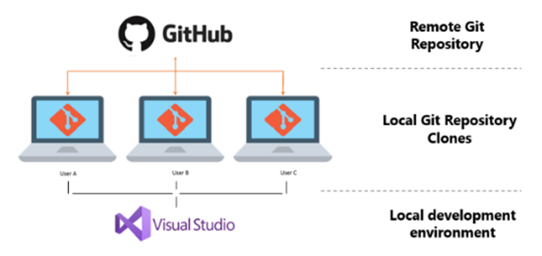

# Welcome to the Intro to GitHub in Visual Studio Series
This is the first lesson in the Introduction to Version Control with GitHub email series! We’re excited to get you started backing up your code to the cloud, syncing across devices, and viewing the revision history of your codebase using GitHub integrated with Visual Studio. In this first email, we’ll give you the email schedule rundown, give you a brief introduction to Git and Version Control, and show you all the tools you’ll need for this series. 

## Prerequisite tools 
*	[Visual Studio](https://aka.ms/vsgitlearn-1-vsdownload) or [Visual Studio for Mac](https://aka.ms/vsgitlearn-1-vsmacdownload) – check out our [more detailed instructions](how-to-install-vs.md) for extra help
*	[GitHub account](https://aka.ms/vsgitlearn-1-create-gh-account)

## What to expect 
During the series you will learn the basics of using Git with Visual Studio. Here is a rundown of what the next few weeks will look like. 
*	Lesson 1 – This welcome email!  
*	Lesson 2 – Cloning a repository from GitHub 
*	Lesson 3 – Exploring a Git repository using Visual Studio
*	Lesson 4 – Adding your existing code to Git and GitHub 
*	Lesson 5 – Daily Workflow with GitHub in Visual Studio and Next Steps
To start your journey let’s look at a brief overview of what Git and Version Control are, and how to get started with a GitHub account. 

## What is Git and Version Control? 
Version control makes it possible to track changes you make to your code over time so you can both track your progress and revert to specific versions. Visual Studio makes it easy to work with Git, which is the most widely used modern version control system. Git is a distributed source control system meaning that to work on your code, your computer needs to have a full copy (clone) of your code’s repository. This gives you the ability to make changes in situations when you don’t have internet access. You will also have multiple backups of your code, a local Git repository on every computer you work on.

   
## What is a repository? 
It is the database that Git uses to track changes made to your code over time. You can update this Git database, your Git repository, by (committing) your changes which would store a picture of your code changes to your local Git repository. Then when you are ready, you can (push) your local Git changes to your remote repository so that you and/or others can access these changes from other locations.
 

## How’d it Go?
Congratulations! You're all set up to be successful learning with this series. 
Please take this quick [survey](https://aka.ms/vsgitlearn-1-survey) to give use your thoughts on this lesson!

