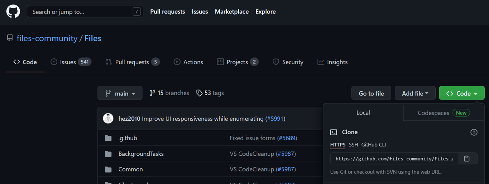
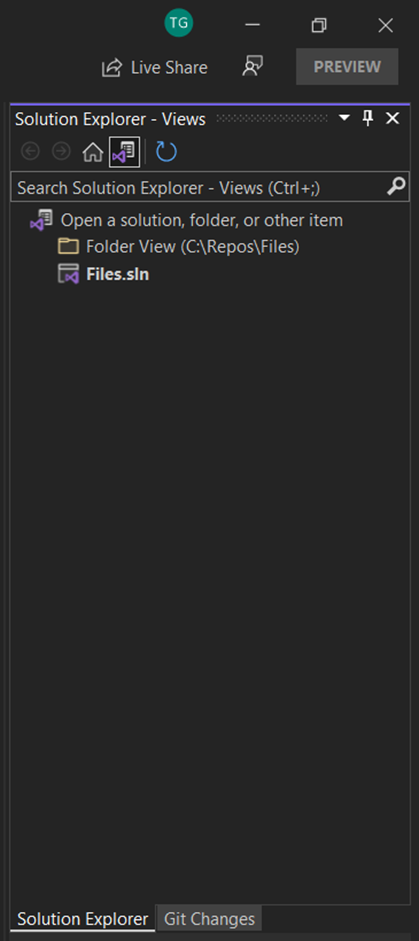
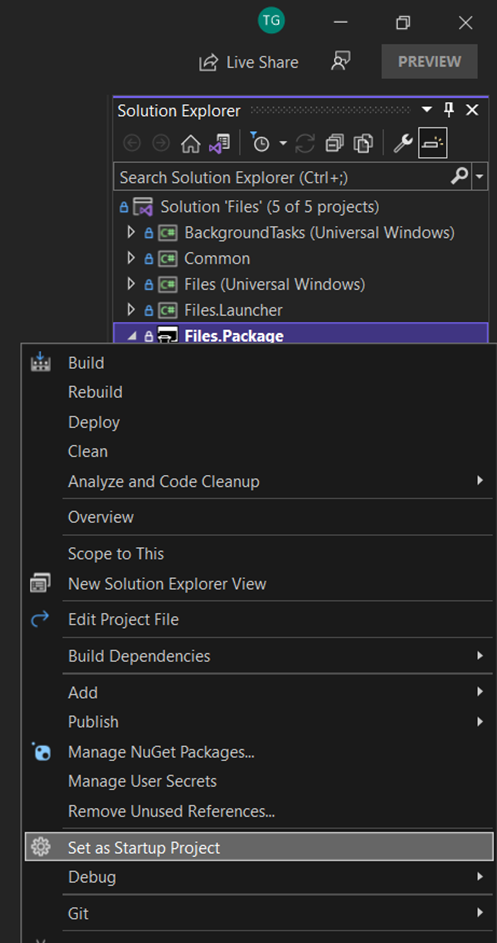
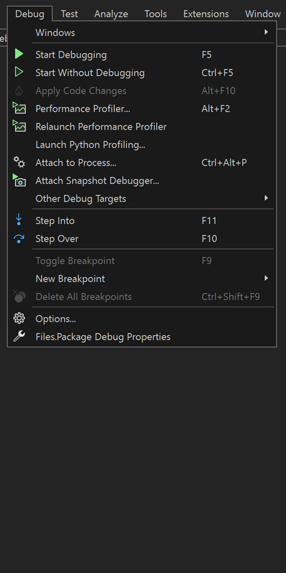
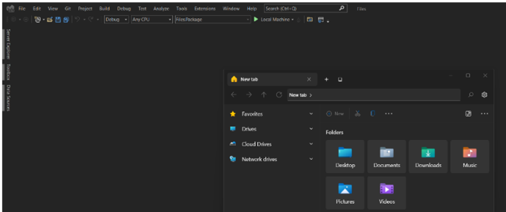

# Accessing Code in the Cloud with GitHub
In this lesson, we’ll go over the basics of Git and GitHub by experimenting with the remote repository that this guide is hosted on. Remember, the remote repository is a copy of the code that lives in the cloud, so we need to make a clone on each device we are using for development. This allows for synchronization of your code across all your machines, and the functionality is seamlessly built into Visual Studio.

## Cloning a Repo
Let’s start by opening a new tab in your web browser and navigating to the main page of this repository. Now click the green Code drop down button on the Code tab and copy the repository URL. 
 

## 🚨 Challenge 1

Time for your first challenge!

| Challenge  | Solution   | Duration   | What you will learn | More information |
| ------------------------------- | ------------------------------- | ----------- |  -------------------------------------- | - |
| Clone this repo to your local machine with Visual Studio | [Verify](images/answer2.png) | 3 min |  How to clone a repo in Visual Studio | [Clone a repo in Visual Studio](https://learn.microsoft.com/en-us/visualstudio/version-control/git-clone-repository?view=vs-2022) |

## Running the Solution
Once Visual Studio finishes cloning, open the Intro to Version Control with GitHub solution by going to Solution Explorer and clicking on Files.sln. After the solution loads, we will need to set the Files.Package project as a startup project by right clicking it as shown below. 
  

Now you are ready to run this code by entering Ctrl + F5 in your keyboard or by selecting Start Without Debugging under the Debug menu. Now Visual Studio will start building, deploying, and running your project. 

## How’d it Go?
Congratulations! You have successfully cloned and run this open-source project. 
Please take this quick survey to give use your thoughts on this lesson & challenge!

## Bonus
Check out more open-source projects on GitHub:
*	[Trending C# repositories on GitHub today](https://github.com/trending/c%23)
*	[halls7588/Data_Structures_in_15_Languages](https://github.com/halls7588/Data_Structures_in_15_Languages)
*	[beginner-friendly · GitHub Topics](https://github.com/topics/beginner-friendly?l=c%23)
*	[beginner-project · GitHub Topics](https://github.com/topics/beginner-project?l=c%23)
