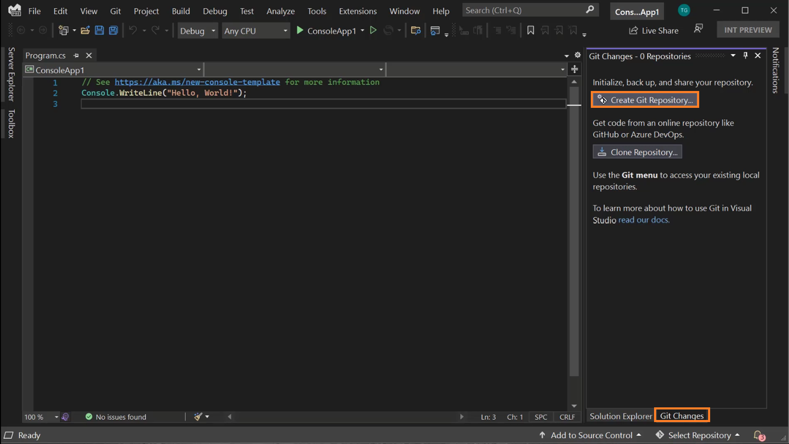
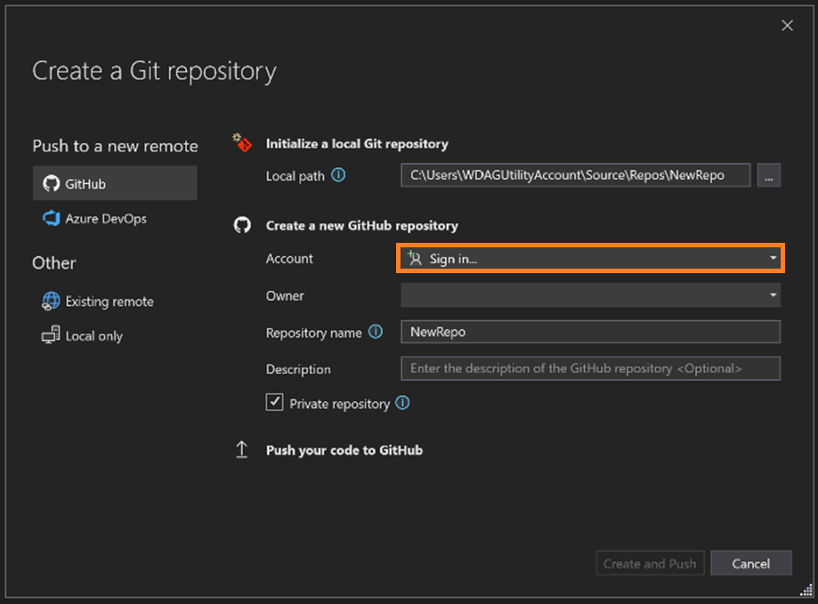
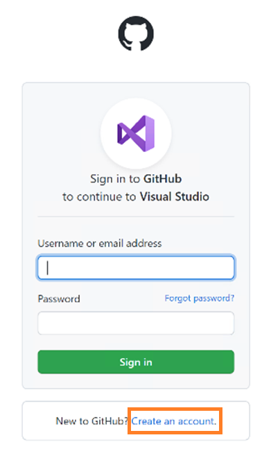
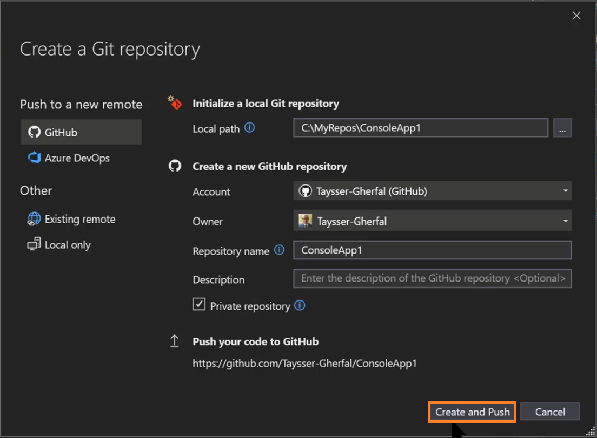
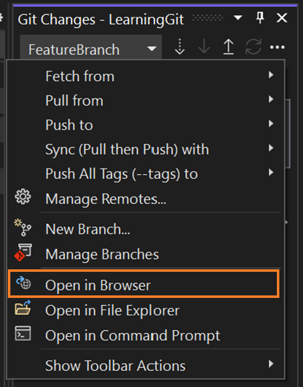

# Syncing your Code to the Cloud

In this lesson, we will learn how to add your existing code to the cloud by creating a Git Repository connected to GitHub.

## Using the Git Changes Window to Create a New Repo
Get started by opening the Create Git Repository experience which can be accessed through the Git Changes window “Git Changes > Create Git Repository”. Note that the Git Changes window is aware that you are not on a Git repository. Therefore, it is trying to help by providing different options for you to consider including a link to documentation. 

Since you already have a GitHub account, all you need to do is sign in. If you didn’t create a GitHub account in the first lesson, you can create a new account by clicking on the create an account option. 

Once you sign in, Visual Studio prepopulates your information. You can choose to provide an optional description for your new repository and then click Create and Push. Visual Studio is going to initialize a local Git repository, create a new GitHub repository, and then push your code to it. Note that your repository on GitHub is going to be private by default. Meaning that you are the only one who has access to it. Feel free to uncheck the Private repository checkbox if you would like to create an open-source repository. 

Once Visual Studio confirms that your new GitHub repository is created, you can check it out on GitHub through the following open in browser functionality in the Git Changes window. 

## 🚨 Challenge - Add your own project to GitHub

| Challenge  | Solution   | Duration   | What you will learn | More information |
| ------------------------------- | ------------------------------- | ----------- |  -------------------------------------- |  -------------------------------------- |
| Add your own project code to GitHub | Verify | 3 min |  How to create a new Git Repository on GitHub with Visual Studio | [Create a Git repo](https://learn.microsoft.com/en-us/visualstudio/version-control/git-create-repository?view=vs-2022) |

## What’s next?
Now that you know how to add your own code to GitHub, you can learn advanced more advanced Git topics like branching! Check the link below to learn more:
*	[Create a branch in Visual Studio | Microsoft Learn](https://learn.microsoft.com/en-us/visualstudio/version-control/git-create-branch?view=vs-2022)
